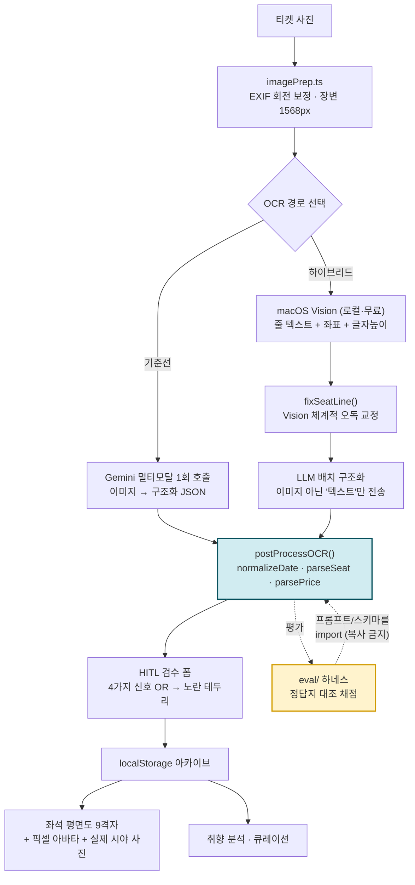

# Classic Lions (클래식 리언즈)

> **Archive a classical concert from one ticket photo — and measure whether the model actually read it right.**

클래식 공연 티켓 사진 한 장으로 관람 이력을 아카이빙하고, 좌석·취향을 분석해 다음 공연을 큐레이션하는 앱.
2026 LearnaThon 수료작(React 19 + Vite + Gemini) 프로토타입에서 출발해, **"돌아가는 것 같다"를 실측 가능한 숫자로 바꾸는 작업**을 이어붙였다.

이 저장소의 중심은 기능이 아니라 **평가 하네스(`eval/`)** 다. 프롬프트를 고치기 전에 채점기부터 만들었다.

---

## 1. 문제

클래식 공연 관람 기록은 남기기 어렵다.

- **티켓이 유일한 원본이다.** 공연장은 지난 공연의 좌석·곡목을 사용자별로 돌려주지 않는다. 종이 티켓을 잃으면 기록도 사라진다.
- **곡목이 텍스트로 존재하지 않는다.** 롯데콘서트홀은 곡목이 텍스트로 있는 공연이 **17.8%** 뿐이고, 나머지는 8,000px짜리 상세 이미지 안에 들어 있다 (`docs/REPERTOIRE_LOTTE.md`).
- **취향을 "낭만주의·피아노"로 요약하면 아무것도 말하지 않은 것이다.** 거의 모든 한국 클래식 관객에게 참이기 때문이다 (`docs/TASTE_MODEL.md`).

그래서 티켓 사진을 읽어 구조화하는 것이 출발점이 된다. 그런데 **LLM에게 티켓을 읽히면 못 읽은 칸을 그럴듯하게 지어낸다.**
아카이빙 앱에서 "빈 칸"과 "그럴듯한 거짓말"은 비용이 전혀 다르다. 사용자가 고칠 수 있는 것은 전자뿐이다.

**따라서 이 프로젝트의 진짜 문제는 "OCR을 붙이는 것"이 아니라 "OCR이 거짓말하는 비율을 재고 줄이는 것"이다.**

---

## 2. 설계



### 단계별 "왜"

| 단계 | 결정 | 왜 |
|---|---|---|
| **전처리** | 장변 1568px 리사이즈 + EXIF 회전 보정 | 원본 4032×3024를 그대로 보내면 토큰만 늘고 판독은 안 좋아진다. 세로로 찍은 사진은 EXIF를 무시하면 모델이 90° 누운 글자를 읽는다. |
| **스키마 강제** | 모든 LLM 호출에 `responseSchema` | 정규식으로 응답을 파싱하면 모델이 형식을 바꿀 때 조용히 깨진다. 프로토타입의 `expandQuery`만 정규식이었고, 실제로 그 지점이 가장 불안정했다. |
| **`seatRaw` + `gradeRaw` 원문 수신** | 파싱은 코드가, 판독은 모델이 | 첫 실측에서 `seat.grade`가 **8.3%** 였다. 원인은 모델이 아니라 **스키마에 등급을 받을 필드가 없던 것**이었다. 파싱을 모델에게 시키면 이런 실패가 "모델이 못한다"로 오진된다. |
| **`normalizeDate()` zero-pad 강제** | 실패 시 저장 차단 | `2025-3-15`는 `new Date()`로는 파싱되지만 문자열 정렬·범위쿼리가 깨진다. 관용하면 나중에 조용히 틀린 캘린더가 나온다. |
| **하이브리드 경로** | Vision 선(先)추출 → 텍스트만 LLM 배치 | Gemini 무료 티어는 **하루 20요청**이다. 이미지 대신 텍스트를 배치로 넘기면 요청 수가 **장수가 아니라 배치 수에 비례**한다 → 20장/일 → **400장/일**. 정확도는 −5.6%p 내주지만 **틀리는 방식이 다르다**(아래 §3). |
| **`fixSeatLine()` 좌석 문맥 한정 교정** | 날짜 문맥에서는 절대 미적용 | Vision은 `15열` → `15일`로 재현성 있게 오독한다. 그런데 무분별하게 `일→열` 치환하면 `2024년 6월 20일`이 통째로 깨진다. 그래서 좌석 문맥으로 판정된 줄에만, 그 안에서도 토큰 패턴에 맞을 때만 적용한다. |
| **`validateBatch()` 개수 불일치 = 에러** | 조용히 채우지 않는다 | 배치 응답이 하나 밀리면 3번 티켓의 좌석이 5번 티켓에 붙는다. 평가는 그것을 "정확도 하락"으로만 보고, 원인은 영영 안 보인다. |
| **HITL 신호를 confidence 하나로 안 씀** | 4개 신호를 OR | 실측에서 모델 자기신고 confidence와 정답률의 **상관이 0.000**이었다. confidence만 쓰면 노란 테두리가 무작위 하이라이트가 되어 검수자의 주의를 엉뚱한 곳에 쓰게 만든다. |
| **평가 하네스가 앱 코드를 import** | 프롬프트·스키마 복사 금지 | 복사본을 두는 순간 평가 대상과 실제 앱이 갈라지고, 측정값이 무의미해진다. `ocrSchema.ts`가 없으면 하네스는 **채점을 시작하지 않고 종료한다.** |
| **모델 라벨은 항상 데이터에서** | CLI 인자·요약 파일에서 안 가져옴 | 실제로 "이전 모델의 숫자에 새 모델 이름이 붙은 리포트"가 만들어진 적이 있다. 어느 모델의 숫자인지 틀리게 적힌 리포트는 없느니만 못하다. |

설계 근거 전문은 [`ARCHITECTURE.md`](ARCHITECTURE.md), 의사결정 기록은 [`docs/DEVLOG.md`](docs/DEVLOG.md).

---

## 3. 결과 / 측정

### 3-1. 이 저장소에서 바로 재현되는 것

아래는 **이 저장소를 클론해서 명령 한 줄로 확인 가능한** 값이다. API 키도 네트워크도 필요 없다.

| 항목 | 값 | 재현 명령 |
|---|---|---|
| 앱 단위 테스트 | **155건 통과 / 0 실패** | `cd app && npm test` |
| 평가 하네스 단위 테스트 | **48건 통과 / 0 실패** | `cd eval && npm test` |
| PII 마스킹 테스트 | **24건 통과 / 0 실패** | `python3 -m unittest discover -s tools -p 'test_*.py'` |
| 타입 체크 | 에러 0 | `cd app && npx tsc --noEmit` |
| 프로덕션 빌드 | 성공 | `cd app && npm run build` |
| 평가 하네스 self-test | 목 데이터 8건 채점 통과 | `node eval/score.mjs --fixtures` |
| 사람이 쓴 정답지 | 웹 크롭 **18장** + 본인 촬영 원본 **14장** | `testdata/eval/*.json` |
| 예술의전당 레퍼토리 | 공연 4,791 · 연주 **13,080** · 고유작품 **5,463** | `app/data/repertoire.json` |
| 롯데콘서트홀 레퍼토리 | 공연 1,501 · 연주 **4,431** · 고유작품 **2,264** | `app/data/repertoire_lotte.json` |
| 좌석 시야 자산 | 공식 **205장** + 본인 촬영 **21장** | `app/assets/vr/`, `app/assets/seatviews/` |

> `node eval/score.mjs --fixtures` 가 내는 숫자는 **목(mock) 데이터 기준**이다. 모델 성능이 아니라 **채점기가 맞게 도는지**를 검증한다. 리포트 상단에도 그렇게 찍힌다.

### 3-2. 실측 기록 (모델 호출이 필요해 저장소에 결과가 없는 값)

`eval/out/` 은 `.gitignore` 대상이라 리포트 원본은 커밋되어 있지 않다. 아래는 측정 당시의 값과 **출처 문서**이며, 재현 명령을 같이 적는다.

**OCR 기준선** — `gemini-3-flash-preview`, 티켓 13장 · 출처 [`docs/DEVLOG.md`](docs/DEVLOG.md) §4-1

| 지표 | 값 |
|---|---|
| 전체 필드 정확도 | **85.0%** |
| 좌석 층·구역·열·번 / venue | 각 100% / 100% |
| date / title | 92.3% / 83.3% |
| `seat.grade` (스키마에 필드가 없었음) | **8.3%** |
| 할루시네이션(날조) / 귀속 오류 | 17.8% (8/45) / 11.1% (5/45) |
| confidence ↔ 정답 상관 / ECE | **0.000** / 0.210 |

**하이브리드 OCR (Vision → LLM 배치)** — 출처 [`docs/HYBRID_OCR.md`](docs/HYBRID_OCR.md)

| 지표 | 기준선 → 하이브리드 |
|---|---|
| 할루시네이션 | 17.8% → **1.8%** |
| 귀속 오류 | 11.1% → **0.0%** |
| 평균 지연 | 20.3s → **4.4s** |
| 전체 정확도 | 85.0% → 79.4% (**−5.6%p**) |
| `seat.grade` | 8% → **58%** |
| 무료 쿼터 환산 | 20장/일 → **400장/일** |

**정확도가 낮은데 왜 남겼나.** 틀리는 방식이 다르기 때문이다. 기준선은 티켓에 없는 값을 지어낸다. 하이브리드는 거의 지어내지 않는다. 아카이빙에서 고칠 수 있는 오류는 "빈 칸"뿐이다.

**본인 촬영 원본 14장** — 출처 [`docs/GROUND_TRUTH_MINE.md`](docs/GROUND_TRUTH_MINE.md)

오답 24개를 분류한 결과 **글자 뭉개짐은 0건**이었고, **11건이 "겹쳐 든 티켓 2장 중 다른 장을 읽음"** 이었다.
겹친 티켓·표기규약 차이를 제외하면 **91.8% (89/97)**. 즉 남은 손실은 판독이 아니라 **선택**이고, 진짜 원인은 `OCR_RESPONSE_SCHEMA`에 좌석이 하나뿐이라 모델이 임의로 고른다는 점이었다.

**곡목 수집** — 출처 [`docs/REPERTOIRE_LOTTE.md`](docs/REPERTOIRE_LOTTE.md)

롯데 곡목 확보율 **17.8% → 69.4% (3.9배)**, 확보분의 74.4%가 로컬 OCR 유래.
결정적 함정: 8,211px 이미지를 통짜로 Vision에 넣으면 **11줄**만 나오고, 세로 1,200px·겹침 150px 타일로 자르면 **177줄**이 나온다. 통짜로 한 번 돌려보고 "OCR도 안 된다"고 결론냈으면 그대로 끝났을 문제다.

**재현:**

```bash
cd eval
npm run eval           # = node run.mjs && node score.mjs  (GEMINI_API_KEY 필요, 무료 티어 20req/일)
npm run eval:report    # 리포트만 다시 그리기
```

측정 방법과 채점 기준(필드별로 다르다)은 [`eval/README.md`](eval/README.md)에 전부 적혀 있다.

---

## 4. 한계와 배운 것

### 지금 못 하는 것 (정확히)

- **배포할 수 없다.** `vite.config.ts`의 `define`은 빌드 시점 문자열 치환이라 Gemini API 키가 번들 JS에 **평문으로 박힌다.** 서버리스 프록시로 키를 옮기기 전까지 `dist/`를 어디에도 올리면 안 된다. 빌드 시 터미널에 경고가 뜨게 해 뒀다.
- **앱이 Supabase를 보지 않는다.** 카탈로그(작곡가 198 / 작품 6,876)는 적재됐지만 앱은 아직 로컬 JSON만 읽는다. **데이터 기반은 완성됐는데 앱이 그 위에 아직 안 서 있다.**
- **추천에 후보 풀이 없다.** 확장된 쿼리가 프롬프트 문자열로만 들어가고 실제 검색 인덱스를 치지 않는다. 즉 **존재하지 않는 공연을 추천해도 막을 방법이 구조적으로 없다.** "Agentic RAG"라고 부르기엔 R이 빠져 있다는 뜻이고, 이건 `ARCHITECTURE.md` §4-1에 설계만 되어 있다.
- **하이브리드 OCR은 CLI 도구(`tools/hybrid_ocr.mjs`)로만 존재한다.** 앱에 통합되어 있지 않다.
- **하이브리드는 macOS 전용이다.** 1단계가 macOS Vision(pyobjc)이라 다른 OS에서는 기준선 경로만 돈다.
- **오프라인 규칙 폴백이 클래식 공연명을 대부분 버린다.** `ruleBasedStructure()` 의 title 후보 필터가 좌석처럼 보이는 줄을 제외하는데, 그 판정이 `N번` 에 가점을 준다. 한국어 클래식 공연명은 `교향곡 2번` 처럼 **작품 번호를 거의 항상 포함**하므로 통째로 걸러진다. 좌석의 `번`과 작품의 `번`이 같은 글자라서 생기는 충돌이다. 현재 동작을 `hybridOcr.test.ts` 에 `[알려진 한계]` 로 고정해 뒀다 — 고칠 때 그 테스트가 먼저 빨개진다. (LLM 경로에는 이 문제가 없다.)

### 틀렸던 것

이 저장소에서 가장 중요한 문서는 [`docs/DEVLOG.md`](docs/DEVLOG.md) **§5 "틀렸던 것들"** 이다. 자신 있게 주장했다가 데이터에 반박당한 항목 22개를 취소선 없이 남겼다. 대표적으로:

1. **"지난 공연 페이지는 내려간다"** → 예당 6,109건·롯데 3,842건 요청에 **HTTP 실패 0**. 곡목 수집 전략 전체가 이 잘못된 전제 위에 서 있었다.
2. **"confidence는 의미 있는 신호다"** → 상관 **0.000**. 저신뢰 건만 2차 패스를 돌리자는 설계의 전제가 무너졌다. confidence 보정 로직을 **전부 제거**했다(가공했더니 ECE가 0.211 → 0.282로 악화됐다).
3. **"롯데 곡목은 OCR 하지 마라 — 비용"** → macOS Vision은 무료·로컬·무제한이었다. 지시를 철회했고 결과가 3.9배였다. 이 프로젝트에서 가장 비쌌던 판단 오류다.
4. **`performerRarity = 1 − n/max`** → 예당 데이터의 55%가 1회 연주라, 27회 연주된 베토벤 황제협주곡이 rarity 0.90 = "매우 희귀"로 나왔다. `percent_rank()` 기반으로 교체했다.
5. **저해상도가 원인이라던 결론** → 원본으로 바꿨더니 정확도가 **오히려 떨어졌다**(78.5% → 75.3%). 실패 원인이 바뀐 것이었다.

### 배운 것

- **감으로 프롬프트를 고치는 순간부터 품질은 랜덤워크가 된다.** 채점기를 먼저 만든 것이 이 프로젝트의 유일하게 중요한 결정이었다.
- **산수로 되는 것을 추론에 맡기지 않는다.** `lifePhase`는 `(작곡연도 − 출생연도) / (사망연도 − 출생연도)`이고, `performerRarity`는 빈도 집계다. LLM을 부를 이유가 없다.
- **"모델이 못한다"는 진단은 대개 틀린다.** `seat.grade` 8.3%는 모델 문제가 아니라 스키마에 필드가 없던 문제였다.
- **원 보고서의 수치를 그대로 옮기지 않았다.** LearnaThon 보고서(`classic_lions_report.docx`)는 "응답 속도 30%+ 개선"이라고 적었지만 비교군이 되는 측정 코드가 없다. 그래서 이 README에는 **그 숫자를 쓰지 않았다.** 보고서와 코드가 불일치하는 3건은 `ARCHITECTURE.md` §1-3에 정리해 뒀다.

---

## 5. 빠른 시작

**필요:** Node.js 22+ (앱은 20+, 평가 하네스가 타입 스트리핑을 써서 22+)

```bash
git clone <repo> && cd classic-lions

# 1) 앱
cd app
npm install
cp ../.env.example .env          # GEMINI_API_KEY 를 채운다
npm run dev                      # http://localhost:3000
```

키 없이도 앱은 뜬다. AI 기능만 실패하고, 조용히 실패하는 대신 화면 상단에 빨간 안내가 뜬다.

```bash
# 2) 검증 (API 키 불필요)
cd app && npm test               # 앱 단위 테스트 155건
npx tsc --noEmit                 # 타입 체크
npm run build                    # 프로덕션 빌드 (⚠️ 배포 금지 — §4 참고)

cd ../eval && npm test           # 평가 하네스 단위 테스트 48건
npm run fixtures                 # 채점기 self-test (목 데이터, = node score.mjs --fixtures)
```

```bash
# 3) 실제 OCR 평가 (API 키 필요)
cd eval
node run.mjs --dry-run           # 호출 없이 대상·설정만 확인
npm run eval                     # 티켓 18장 OCR → 채점 → eval/out/report.md
```

무료 티어는 **하루 20요청**이다. `run.mjs`는 성공 응답을 캐시하고 실패만 재호출하므로 쿼터가 회복된 뒤 다시 돌리면 이어서 채워진다.

```bash
# 4) PII 마스킹 (macOS 전용 — pyobjc + Pillow)
python3 tools/redact_pii.py testdata/tickets/lotte_met_opera_2024.jpg --report
python3 -m unittest discover -s tools -p 'test_*.py'   # 마스킹 규칙 테스트
```

---

## 6. 프로젝트 구조

```
classic-lions/
├─ app/                      React 19 + Vite 앱 (로컬 프로토타입)
│  ├─ services/
│  │  ├─ ocrSchema.ts        ⭐ 계약 파일 — 프롬프트·스키마·순수 파서
│  │  │                         (브라우저 API 없음. eval/ 이 이 파일을 import 한다)
│  │  ├─ hybridOcr.ts        Vision → LLM 배치 구조화 + 오프라인 규칙 폴백
│  │  ├─ geminiService.ts    Gemini 호출 · 통계 빠른 경로 · 에러 메시지
│  │  ├─ seatGeometry.ts     좌석 문자열 → 평면도 9격자 좌표 (5단계 강등)
│  │  ├─ imagePrep.ts        EXIF 회전 보정 · 리사이즈 (브라우저 전용)
│  │  ├─ storage.ts          localStorage 영속화 + 쿼터 초과 처리
│  │  └─ __tests__/          단위 테스트 155건 (Node 내장 러너, 의존성 0)
│  ├─ components/            Dashboard · TicketOCR · seatmap · avatar
│  ├─ data/                  레퍼토리 JSON · 좌석 시야 인덱스 · 앙코르
│  └─ assets/                좌석 시야 226장 (VR 205 + 본인 촬영 21)
│
├─ eval/                     ⭐ OCR 평가 하네스
│  ├─ run.mjs                이미지 → Gemini 호출 (캐시·재시도·모델 분리 저장)
│  ├─ score.mjs              정답지 대조 채점 (--fixtures 로 self-test)
│  ├─ report.mjs             한국어 리포트 생성
│  ├─ lib/scoring.mjs        필드별 채점 + 할루시네이션 5단 판정
│  ├─ lib/__tests__/         하네스 자체의 단위 테스트 48건
│  └─ fixtures/              채점기 self-test용 목 데이터
│
├─ tools/                    수집·OCR·마스킹 CLI (Python 25 + Node 3)
│  ├─ redact_pii.py          ⭐ PII 마스킹 — 가린 뒤 재OCR 해서 검증한다
│  ├─ test_redact_pii.py     마스킹 판정 테스트 24건 (macOS 프레임워크 불필요)
│  ├─ hybrid_ocr.mjs         하이브리드 OCR CLI
│  ├─ vision_ocr.py          macOS Vision 래퍼 (타일 분할)
│  ├─ sac_*.py               예술의전당 수집·분석 파이프라인
│  └─ lotte_*.py             롯데콘서트홀 수집·분석 파이프라인
│
├─ testdata/                 티켓 이미지 18장 + 사람이 쓴 정답지 2벌
├─ docs/                     설계 조사 17편 (DEVLOG · HYBRID_OCR · TASTE_MODEL …)
├─ db/ · supabase/           스키마 · 마이그레이션 · rarity 재계산 SQL
└─ ARCHITECTURE.md           목표 아키텍처 + 프로토타입 결함 분석
```

**읽는 순서 추천:** [`docs/DEVLOG.md`](docs/DEVLOG.md) → [`eval/README.md`](eval/README.md) → [`app/services/ocrSchema.ts`](app/services/ocrSchema.ts)

---

## 7. 환경 변수

[`.env.example`](.env.example) 참고. 실제 값은 커밋하지 않는다 — `.env`, `.env.local` 은 `.gitignore` 대상이다.

| 변수 | 쓰는 곳 | 비고 |
|---|---|---|
| `GEMINI_API_KEY` | `app/`, `eval/` | https://aistudio.google.com/apikey . **형식 검증을 하지 않는다** — 구형 `AIza…`, 신형 `AQ.…` 둘 다 유효하다 |

키 탐색 순서(앞이 우선): `eval/.env.local` → `eval/.env` → `.env.local` → `.env` → `app/.env.local` → `app/.env`

Supabase 적재 스크립트(`tools/seed_catalog.py`)는 환경변수를 쓰지 않는다. DSN을 **인자로만** 받는다 —
`python3 tools/seed_catalog.py --dsn "postgresql://..."`. 셸 히스토리에 남는 것이 싫으면 `--out seed.sql` 로 SQL만 뽑아 psql에 먹이면 된다.

키 값은 로그·리포트·저장 파일 어디에도 남지 않는다. API 실패 메시지도 `redact()` 를 거친다.

---

## 8. 라이선스 · 데이터 출처

- 공식 좌석 시야 자산(`app/assets/vr/`)은 롯데문화재단·예술의전당 소유다. **공개 배포하려면 사전 허락이 필요하다** (`docs/VR_ASSETS.md` §5). 이 저장소에는 128×74·24색으로 픽셀화한 것만 들어 있다.
- 레퍼토리 데이터는 각 공연장 공개 페이지에서 수집했다. 작품 사전은 [Open Opus](https://openopus.org/) (CC0).
- 본인이 촬영한 좌석 시야 사진(`app/assets/seatviews/`)은 저작권자가 프로젝트 소유자 본인이다.
- 티켓 사진은 PII 마스킹(`tools/redact_pii.py`)을 거친 것만 커밋한다. 원본은 `.gitignore` 대상이다.
