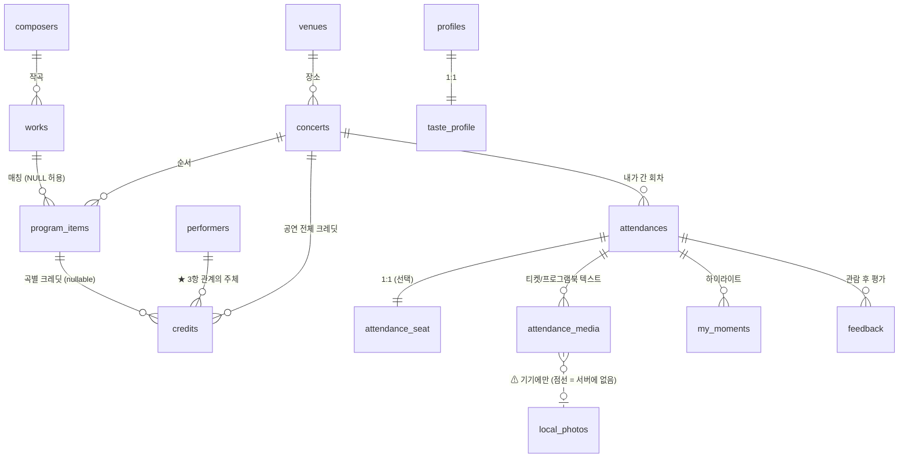

# 데이터 스키마 설계 — 아카이빙 앱은 스키마가 곧 제품이다

작성일: 2026-08-27
실물: [`db/schema.sql`](../db/schema.sql)
대체 대상: `ARCHITECTURE.md` §3 (7개 테이블 초안)
근거: [TASTE_MODEL.md](TASTE_MODEL.md) · [WORK_TAGGING.md](WORK_TAGGING.md) · [COMPETITIVE_RESEARCH.md](COMPETITIVE_RESEARCH.md) §4-8 / §5 / §6-6 · 뉴욕필 CC0 덤프 실측

---

## 0. 이 설계가 지키는 5개 규칙

나중에 하나씩 흔들릴 것들이라 먼저 못 박는다.

| # | 규칙 | 어긴 사람의 결말 |
|---|---|---|
| 1 | **원본 사진은 서버에 없다.** blob 컬럼도, 원본 URL 컬럼도, object key 컬럼도 없다 | 플앱: 이미지 1,000만 파일 → 서버비 폭증 → 다운로드가 나와도 적자 (§6-6) |
| 2 | 열거형은 PG ENUM 이 아니라 `TEXT + CHECK` | ENUM 값 삭제는 PG 에 없고 SQLite 엔 타입 자체가 없다 |
| 3 | 배열은 PG array 가 아니라 `jsonb` | SQLite JSON1 과 형태가 같아져 스키마 1벌이 유지된다 |
| 4 | 사용자 소유 테이블은 전부 `id(uuidv7) / updated_at / deleted_at / rev` | 오프라인에서 만든 레코드가 충돌하거나, 삭제가 다른 기기에 전파되지 않는다 |
| 5 | 파싱 결과는 `*_raw` 원문과 정규화 값을 **둘 다** 남긴다 | 파싱 규칙은 고칠 수 있지만 티켓은 다시 못 찍는다 |

**정규화 상한선**: 가장 무거운 화면(관람 상세)이 조인 5개다. 이걸 넘기는 정규화는 하지 않았다.

> **검증 상태**: `db/schema.sql` 을 타입만 SQLite 로 치환해 실제로 실행했다 —
> 테이블 17 · 인덱스 37 · 뷰 4가 파스 에러 없이 생성된다. 유일한 실패는
> `ALTER TABLE … ADD CONSTRAINT`(PG 전용, SQLite 는 인라인 FK 로 대체) 한 줄이다.
> ⚠ 다만 **실제 Postgres 에 적용해보지는 못했다** (이 맥에 psql·docker 없음). §13 참조.

---

## 1. 테이블 목록 — 19개 (서버 16 + 로컬 전용 3, + 메타 `schema_migrations`)

```
LAYER 1  카탈로그 (서버 소유, 클라이언트는 읽기만)
  composers          작곡가 사전            Open Opus + Wikidata
  works              작품 마스터 + 스타일 태그  (WorkStyle 을 별도 테이블로 안 쪼갬)
  performers         ★ 연주자/단체          ← ARCHITECTURE 에 아예 없던 것
  venues             공연장(홀 단위)

LAYER 2  이벤트 (공연 사실, 사용자 간 공유)
  concerts           한 회차 = 한 행
  program_items      그날 울린 순서 (인터미션·앵콜 포함)
  credits            ★ (사람/단체, 악기, 역할) 3항 관계

LAYER 3  개인 (RLS 필수, 동기화 대상)
  profiles           명시 취향 설정
  attendances        "내가 갔다" — 개인 아카이브의 앵커
  attendance_seat    좌석 + 음향 인상
  attendance_media   사진의 "잔해" — 텍스트 + 선택적 썸네일 (원본 아님)
  my_moments         내가 찍은 하이라이트
  feedback           추천 좋아요/싫어요
  taste_profile      롤링 취향 요약 (쓰기 시점 갱신)
  id_redirects       병합 리다이렉트 (중복 연주자/공연을 합칠 때)
  sync_clients       기기별 업로드 워터마크

LAYER 4  동기화 인프라 (⚠ 기기에만 존재)
  local_photos       원본 사진의 기기 내 위치
  outbox             오프라인 변경 큐
  sync_state         테이블별 델타 커서
```

`work_innovations` 와 임베딩 컬럼은 **v2 예약**이다. 이유는 §4-3 과 §13.
`schema.sql` 맨 아래에 DDL 이 주석으로 완성된 채 대기한다.

---

## 2. ERD



읽는 법: **왼쪽 두 층(카탈로그·이벤트)은 사실, 오른쪽 한 층(개인)은 나의 기록.**
동기화 정책도, RLS 정책도, 백업 정책도 이 선을 따라 갈린다.

---

## 3. ★ 연주자 3항 관계 — 가장 큰 구멍을 메운 자리

### 3-1. 무엇이 문제였나

`ARCHITECTURE.md` §3 의 연주자 표현은 이것뿐이다.

```sql
CREATE TABLE concerts ( ...  artist TEXT,  ... );
```

이 한 컬럼으로는 답할 수 없는 질문:

| 질문 | 왜 못 하나 |
|---|---|
| "임윤찬을 몇 번 봤나" | `artist LIKE '%임윤찬%'` — `'임윤찬, 조성진'` 과 `'피아노 임윤찬'` 이 다른 문자열이다 |
| "내가 가장 많이 본 **지휘자**" | 지휘자인지 협연자인지 오케스트라인지 구분이 없다 |
| "협주곡에서 내가 고른 독주자들" | 역할 축이 없다 |
| "3번 곡만 협연자가 다른 사람" | 공연 단위 컬럼이라 곡별 표현이 불가능하다 |

그리고 이건 취향의 변두리가 아니다. 예당 2025 흥행 1~3위가 **전부 연주자 이름**이다(임윤찬·조성진·조수미, §3-4).

### 3-2. 해법 — 두 테이블, 하나의 nullable

```sql
performers (id, kind, name_ko, name_en, sort_name, aliases, main_inst, ...)
credits    (id, concert_id, program_item_id NULL, performer_id, role, instrument,
            billing_order, is_headliner, raw_text, source, match_conf)
```

설계의 전부는 **`program_item_id` 가 nullable 이라는 것** 하나다.

```
program_item_id IS NULL   →  이 크레딧은 "공연 전체"에 붙는다
                             (오케스트라, 상주 지휘자 — 하루 종일 같은 사람)
program_item_id IS NOT NULL → 이 크레딧은 "그 곡에만" 붙는다
                             (예당 상세페이지의 `/ 피아노 임동혁` 처럼 곡마다 다른 협연자)
```

흔한 경우(공연 전체)가 행 1개로 끝난다. 드문 경우(곡별)도 같은 테이블에서 표현된다.
**테이블을 두 개로 쪼개고 UNION 하는 설계를 피했다.** 조인 예산을 여기 쓰지 않는다.

### 3-3. `role` 어휘 12종

| role | 한국어 | instrument 규칙 |
|---|---|---|
| `conductor` | 지휘 | NULL |
| `soloist` | 협연 (오케스트라와 겨루는 기악 독주) | `piano` `violin` … |
| `recitalist` | 독주 (리사이틀의 주인공) | 악기 |
| `vocalist` | 성악 | **성부**를 넣는다 — `soprano` `mezzo` `tenor` `baritone` `bass` |
| `ensemble` | 앙상블 구성원 | 악기 |
| `orchestra` | 오케스트라(단체) | NULL — CHECK 로 강제 |
| `choir` | 합창단(단체) | NULL — CHECK 로 강제 |
| `accompanist` | 반주 | 악기 |
| `concertmaster` | 악장 | 보통 `violin` |
| `assisting` | 조연 (뉴욕필 `A`) | 악기 |
| `narrator` | 내레이션 | NULL |
| `other` | | |

`soloist` 와 `recitalist` 를 나눈 이유가 `TASTE_MODEL.md` §0 의 출발점 그 자체다 —
*"라흐마니노프 협주곡을 들으러 가는 사람"* 과 *"쇼팽 녹턴 리사이틀을 가는 사람"* 은
같은 `{romantic, piano}` 로 떨어지면 안 된다. **역할이 그 둘을 가른다.**

`vocalist` 의 instrument 에 성부를 넣는 규칙은 뉴욕필과 같다(그쪽 `soloistInstrument` 상위값에
`Soprano 4,942` `Tenor 2,274` `Baritone 1,887` 이 들어 있다). 성부는 실제로 그 사람의 악기다.

### 3-4. `performers.kind` — 뉴욕필이 안 해서 생긴 사고를 피하는 컬럼

뉴욕필 덤프에는 연주자의 **종류**가 없다. 사람도 단체도 전부 `soloist` 행이다.
그래서 `soloistInstrument` 에 악기가 아닌 값을 넣어 메꿨다. 실측:

```
Dancer 5,291   Chorus 2,484   Ensemble 541   Brass Quintet 396
Narrator 356   Boys Choir 204  Orchestra 198  Jazz Ensemble 145 …
→ 62,768 소리스트 행 중 10,666 (17%) 가 "사람 + 악기"가 아니다
```

`kind ∈ {person, orchestra, ensemble, choir, company}` 를 두면 이 17% 가 애초에 안 생긴다.
악기 통계를 낼 때 `Dancer` 를 걸러낼 필요도 없어진다.

### 3-5. **예시 데이터** — "정명훈 지휘 / 조성진 피아노 / 서울시향"

한 공연이 실제로 어떻게 앉는지 전부 보인다.

**공연**
| id | title | venue_id | date | start_time | program_arch |
|---|---|---|---|---|---|
| `C1` | 서울시립교향악단 정기연주회 | `V-예당콘서트홀` | 2026-03-20 | 19:30 | `classic_three` |

**performers**
| id | kind | name_ko | name_en | main_inst |
|---|---|---|---|---|
| `P-정명훈` | person | 정명훈 | Myung-Whun Chung | — |
| `P-조성진` | person | 조성진 | Seong-Jin Cho | piano |
| `P-서울시향` | orchestra | 서울시립교향악단 | Seoul Philharmonic Orchestra | — |

**program_items** (`concert_id = C1`)
| seq | item_type | work_id | raw_text | is_encore | encore_order |
|---|---|---|---|---|---|
| 1 | work | `beethoven-coriolan-op62` | `베토벤 / 코리올란 서곡 Op.62` | false | — |
| 2 | work | `beethoven-pc5-op73` | `베토벤 / 피아노 협주곡 5번 "황제" Op.73` | false | — |
| 3 | **intermission** | NULL | `INTERMISSION` | false | — |
| 4 | work | `brahms-sym1-op68` | `브람스 / 교향곡 1번 c단조 Op.68` | false | — |
| 5 | work | `schubert-impromptu-op90-3` | `슈베르트 / 즉흥곡 Op.90-3` | **true** | **1** |

**credits** — ★ 여기가 3항 관계다
| concert_id | program_item_id | performer_id | role | instrument | is_headliner |
|---|---|---|---|---|---|
| `C1` | **NULL** | `P-정명훈` | `conductor` | NULL | true |
| `C1` | **NULL** | `P-서울시향` | `orchestra` | NULL | false |
| `C1` | `seq=2` | `P-조성진` | `soloist` | `piano` | true |
| `C1` | `seq=5` | `P-조성진` | `recitalist` | `piano` | false |

읽는 법:

- 정명훈·서울시향은 `program_item_id = NULL` → **공연 전체**. 곡마다 4번씩 복제하지 않는다.
- 조성진은 2번 곡(협주곡)에만 붙는다 → `soloist / piano`.
- **같은 사람이 앵콜에서는 `recitalist` 다.** 오케스트라 없이 혼자 쳤기 때문이다.
  이 한 행 덕분에 *"이 사용자는 협주곡 협연자를 보러 가지만 앵콜에서 독주도 들었다"* 가 데이터로 남는다.
- 인터미션(seq 3)이 곡 목록 **안에** 있다. seq 2 앞의 협주곡 / seq 4 뒤의 교향곡 →
  `program_arch = classic_three` 판정이 여기서 나온다.

**곡별로 연주자가 다른 경우** (예당 상세페이지식 표기)
```
2번 곡: 피아노 임동혁      → credits(program_item_id = seq2, P-임동혁, soloist, piano)
5번 곡: 바이올린 클라라 주미 강 → credits(program_item_id = seq5, P-클라라주미강, soloist, violin)
지휘·오케스트라는 그대로 program_item_id = NULL 행 2개
```
행 4개. 테이블 추가 없음.

**이 구조가 바로 답하는 질문들**
```sql
-- "임윤찬을 몇 번 봤나"  (인덱스 idx_credits_performer 한 방)
SELECT count(DISTINCT a.id) FROM attendances a
JOIN credits c ON c.concert_id = a.concert_id
WHERE a.user_id = :u AND c.performer_id = :p AND a.deleted_at IS NULL;

-- "내가 가장 많이 본 지휘자"
SELECT * FROM v_my_performers WHERE user_id = :u AND role = 'conductor' ORDER BY times DESC;

-- "협주곡에서 내가 고른 독주자"
SELECT p.name_ko, count(*) FROM attendances a
JOIN program_items pi ON pi.concert_id = a.concert_id
JOIN works w          ON w.id = pi.work_id AND w.forces = 'concerto'
JOIN credits cr       ON cr.program_item_id = pi.id AND cr.role = 'soloist'
JOIN performers p     ON p.id = cr.performer_id
WHERE a.user_id = :u GROUP BY p.name_ko ORDER BY 2 DESC;
```

---

## 4. 테이블별 결정과 그 근거

### 4-1. `concerts` — 회차를 1급으로, `program` 층은 접었다

뉴욕필은 2층이다: `program`(레퍼토리+캐스트가 완전히 같음) → `concert`(날짜·장소).
실측 **14,992 programs → 23,205 concerts** (평균 1.55).

우리는 **1층으로 접었다.** 이유 셋:

1. 우리 사용자는 *그날 밤 하나*에 간다. 좌석·음향·앵콜·감상이 전부 회차 속성이다.
2. 뉴욕필 자신의 규칙이 이미 program 층을 무너뜨린다 —
   > "어느 날 소리스트가 앵콜을 하고 다른 날 안 하면, 앵콜이 있는 쪽은 **다른 program 이 된다**"

   즉 앵콜을 진지하게 다루는 순간 program ≈ concert 가 된다. 우리는 앵콜을 P1 기능으로 넣기로 했다.
3. 1인 개발자에게 3층(program → concert → attendance)은 조인 하나가 통째로 늘어나는 값이다.

**대신 `run_id` 컬럼 하나**를 뒀다. KOPIS 공연ID 1건(= 날짜 범위)이 `run_id` 1개가 되고,
그 아래 회차별 `concerts` 행이 깔린다. "같은 공연 다른 회차"는 이 컬럼으로 묶인다.
**테이블 0개, 컬럼 1개.**

> `ARCHITECTURE.md` §3 의 `date_start` / `date_end` 는 그래서 사라졌다. KOPIS 범위는
> 수집 시점에 회차로 펼친다. 아카이빙 앱의 원자는 "기간"이 아니라 "그날 밤"이다.

### 4-2. `program_items` — 뉴욕필에서 배운 것 3개가 전부 여기 있다

| 배운 것 | 실측 | 우리 컬럼 |
|---|---|---|
| 인터미션이 곡 목록 **안의 항목**이다 | 88,533 work 행 중 **11,944** 가 `<interval/>` | `item_type='intermission'` + `seq` |
| **악장**이 별도 행이다 (`ID="workID*movementID"`) | 프로그램의 **20%** (3,007/14,992)에서 같은 workID 가 여러 번 등장 | `movement` (전곡이면 NULL). 묶음 키는 `work_id` |
| 편곡자를 필드로 안 두고 제목에 묻었다 | `(ARR. Seipp)` 형태 제목 **7,190건** | `arranger` 컬럼 — **뉴욕필보다 나은 부분** |

그리고 뉴욕필에 **없는** 것: 앵콜 플래그. 실측하면 `ENCORE (UNSPECIFIED)` 라는 가짜 작품 제목이
**32건** 있을 뿐이다. `is_encore` / `encore_order` 는 우리 추가분이고, §P1-1 의 요구를 정면으로 받는다.

**인터미션 서수는 컬럼으로 두지 않았다.** `seq` 로 계산된다(앞쪽 인터미션 개수를 세면 된다).
반면 `encore_order` 는 컬럼이다 — 사용자가 3개 앵콜 중 2번째만 기억해 적는 경우가 실재하고,
그때 순서는 `seq` 에서 복원되지 않는다.

> 뉴욕필은 서수를 라벨 문자열에 넣었다(`Intermission` 11,848 / `Intermission-Short` 51 /
> `Intermission-Second` 44 / `Intermission-Third` 1). **값과 종류가 한 문자열에 섞였다.**
> 우리는 그 문자열을 `raw_text` 에 그대로 보존하되 구조는 `seq` 가 갖는다.

### 4-3. `works` — WorkStyle 을 **별도 테이블로 쪼개지 않았다**

`WORK_TAGGING.md` 의 `WorkStyle` 인터페이스는 `works` 와 1:1 이다.
1:1 을 분리하면 얻는 것은 이론적 깔끔함이고, 잃는 것은 모든 취향 쿼리의 조인 1개다.
**merge 했다.** 컬럼이 30개쯤 되지만 nullable 이고, 1인 개발자가 읽기엔 한 테이블이 낫다.

두 가지를 경쟁 조사 판정대로 바꿨다.

- **mood**: `valence/energy/tension` 연속 3축 → **`mood_tags` 고정 어휘(Idagio 15종)가 1차.**
  연속값은 태그에서 파생시키는 보조 컬럼으로 남겼다(§6-4).
  검증이 "부호 일치율"에서 정확도/F1 로 깔끔해지고, 사용자에게 *"당신은 Tragic·Passionate 를 고르는 사람"* 이라고 말할 수 있다.
  ⚠ jsonb 배열 원소를 CHECK 로 강제하는 문법이 PG/SQLite 에서 갈려서, 앱 계층 검증 + `v_bad_mood_tags` 감시 뷰로 대신했다.
- **`innovations`**: v1 제외 (§6-5). `work_innovations` DDL 은 `schema.sql` 맨 아래에 주석으로 완성된 채 대기한다.

### 4-4. `composers` 를 `works` 에서 뗀 이유

`ARCHITECTURE.md` §3 은 `works.composer` / `works.composer_ko` 문자열이었다.
뗀 이유는 통계가 아니라 **생몰년**이다. 같은 데이터가 두 곳에서 필요하다:

- `works.life_phase` 계산 — `(작곡연도 − 출생연도) / (사망연도 − 출생연도)` (WORK_TAGGING §3)
- "오늘의 작곡가" — 그날 생일·기일 (§P2-3, 추가 비용 0)

작곡가 220명 × 문자열 반복을 피하는 것보다, **생몰년을 한 곳에 두는 것**이 이 분리의 값이다.

### 4-5. `attendances` — 사전 라벨에 `chosen_at` 이 있어야 하는 이유

`chosen_reason` (P1-3) 은 **관람 전**에 남기기 때문에 값이 있다.
관람 후에 적은 이유는 사후 합리화이고, 지도학습 라벨로서 성격이 다르다.

그래서 `chosen_at timestamptz` 를 같이 둔다. `chosen_at < attended_on` 인 행만 pre-hoc 로 취급한다.
**타임스탬프가 없으면 사전 라벨과 사후 합리화를 구분할 수 없고, 그러면 이 필드의 존재 이유가 사라진다.**

한 줄 감상(`one_liner`)과 상세 감상(`note`)은 처음부터 다른 컬럼이다 (§P1-5 / Letterboxd 실패).
`visibility` 는 v2 소셜 대비로 지금 넣어 뒀다 — 나중에 추가하면 기존 행의 기본값을 정하는 문제가 생긴다.

### 4-6. `attendance_seat` — 1:1 인데 왜 분리했나

파싱 필드가 9개이고 **자체 confidence** 를 갖는다. `attendances` 에 합치면
"그날의 기록"과 "문자열 파싱 결과"가 한 행에 섞이고, `attendances` 를 읽는 모든 쿼리가 그 9개를 끌고 다닌다.

여기 붙는 것이 `acoustic_rating` / `acoustic_note` / `sightline_rating` (§P1-2)다.
비용이 거의 0인데 클래식 색이 가장 진하게 나는 필드고, 쌓이면
*"당신은 2층 앞쪽에서 들을 때 만족도가 높습니다"* 라는 문장이 나온다.

`floor` 를 `1..5` 로 CHECK 한 것은 장식이 아니다. 롯데 실물 티켓에 `입장: 8층 2번 게이트` 와
`좌석: 객석 1층 B구역 15열 01번` 이 나란히 인쇄된다 (`RESEARCH_seat_avatar` §2.3-A).
**범위 제약이 게이트 오탐을 DB 레벨에서 한 번 더 막는다.**

---

## 5. 🔴 사진 — 스키마가 강제하는 방식

§6-6 의 사망 경고를 "정책"으로 두면 언젠가 깨진다. **제약으로 둔다.**

### 5-1. 세 자리로 쪼갠다

| 무엇 | 어디 | 크기 |
|---|---|---|
| 원본 4032×3024 사진 | **기기에만.** `local_photos.file_uri` | 5~10MB / 관람 1회 |
| 추출된 텍스트 + OCR 신뢰도 | 서버 `attendance_media.ocr_text` | 수 KB |
| (선택) 저해상도 썸네일 | 서버 `attendance_media.thumb` | **≤ 32KB, ≤ 320px** |

### 5-2. 스키마가 물리적으로 막는 것

```sql
CONSTRAINT thumb_bytes_small CHECK (thumb IS NULL OR octet_length(thumb) <= 32768),
CONSTRAINT thumb_dim_small   CHECK (thumb_w IS NULL OR (thumb_w <= 320 AND thumb_h <= 320)),
CONSTRAINT thumb_all_or_none CHECK ((thumb IS NULL) = (thumb_w IS NULL))
```

4032px 원본은 이 테이블에 **들어갈 수 없다.** INSERT 가 거부된다.
"실수로 원본을 올리는 코드"를 작성하는 것이 불가능하다.

그리고 **없는 컬럼**이 있는 컬럼만큼 중요하다:
- `ticket_img_key` — `ARCHITECTURE.md` §3 `archive` 에 있던 R2 object key. **삭제했다.**
- `photo_url`, `image_url`, `storage_path` — 어느 테이블에도 없다.
- `concerts.poster_url` 은 남겼지만 이건 **KOPIS 의 URL 을 가리키는 링크**다. 우리가 미러링하지 않는다.

### 5-3. 이게 P0-1(데이터 유실)과 충돌하는 것을 안다

사진을 서버에 안 두면 기기 분실 = 사진 소실이다. 이 카테고리의 사망 원인 1위가 데이터 유실이다.
**해소책은 "로컬 저장 + 명시적 내보내기"** 뿐이고, 그래서 §6 을 스키마의 일부로 넣었다.

`local_photos.last_seen_at` 은 그 보조 장치다. 기기 갤러리에서 원본이 사라진 것을 감지해
사용자에게 알린다(조용히 깨진 링크를 남기지 않는다).

⚠ 한 가지 정직하게 남긴 긴장: `GROUND_TRUTH_MINE.md` 실측은 **원본 해상도가 저해상도보다 OCR 이 정확하다**고
말한다. 그래서 OCR 은 원본을 보내야 하고, 서버는 그걸 **처리 후 즉시 폐기**해야 한다.
"업로드하지 않는다"가 아니라 **"보관하지 않는다"** 다. 스키마에 저장 자리가 없는 것이 그 보증이다.

---

## 6. CSV 내보내기를 전제로 한 설계

내보내기는 "나중에 붙이는 기능"이 아니다. `schema.sql` 에 뷰 2개가 들어 있다.

| 뷰 | 1행의 의미 | 용도 |
|---|---|---|
| `v_export_attendance` | 관람 1회 | 사람이 스프레드시트에서 바로 읽는 형태 |
| `v_export_program` | 곡 1개 | 취향 분석의 원재료를 사용자도 볼 수 있게 |

**설계에 실제로 미친 영향 3가지** — 이게 "전제로 했다"의 뜻이다.

1. **CSV 는 조인을 못 한다.** 그래서 `v_export_attendance` 가 연주자·프로그램·앵콜을
   `string_agg` 로 한 칸에 접는다. 이 접기가 가능하려면 `credits.role` 이 **읽을 수 있는 라벨**이어야 한다
   → role 을 정수 코드가 아니라 문자열 enum 으로 둔 이유 중 하나.
2. **원문이 반드시 있어야 한다.** `program_items.raw_text`, `concerts.title_raw`,
   `attendance_seat.raw` — 매칭이 실패한 행도 CSV 에는 **뭔가 적혀 있어야** 한다.
   `work_id IS NULL` 인 행이 빈 칸으로 나오면 사용자는 데이터를 잃었다고 느낀다.
3. **소프트 삭제.** `deleted_at IS NULL` 필터가 뷰에 박혀 있다. 물리 삭제를 하면
   내보내기와 동기화가 서로 다른 진실을 갖게 된다.

가져오기(import)도 같은 형태를 받는다. 포도알이 CSV 가져오기를 이미 갖고 있고,
경쟁 조사 P0-1 이 v1 요구사항으로 못 박았다.

---

## 7. 뉴욕필 CC0 덤프에서 실제로 배운 것

문서만 읽지 않고 받아서 돌렸다.
`https://raw.githubusercontent.com/nyphilarchive/PerformanceHistory/main/Programs/json/complete.json`
(37.9MB, 2026-08-27 다운로드)

```
programs 14,992  ·  concerts 23,205  ·  work 행 88,533  ·  soloist 행 62,768
distinct soloist 7,964  ·  distinct conductor 897  ·  distinct workID 13,300
```

### 배운 것 (스키마에 반영됨)

| # | 발견 | 우리 반영 |
|---|---|---|
| 1 | `soloistRole` 이 **`S`(Soloist)/`A`(Assisting) 2값뿐**이다 | 너무 거칠다. `role` 을 12값으로 폈다 |
| 2 | 그 부족분을 `soloistInstrument` 에 밀어넣었다 — Dancer 5,291 / Chorus 2,484 / Orchestra 198 … **62,768행 중 10,666(17%)이 사람+악기가 아니다** | `performers.kind` 신설 |
| 3 | **`conductorName` 이 work 행의 스칼라 컬럼**이다. 프로그램 565건에 지휘자가 2명 이상 | 지휘자도 `credits` 의 한 행. 곡별 지휘자 교대가 자연스럽게 표현된다 |
| 4 | 인터미션이 works 배열 안의 항목 (11,944행), 지휘자·작곡가 없음 | `item_type='intermission'` + `seq` |
| 5 | 인터미션 **서수가 라벨 문자열에 섞여 있다** (`Intermission-Second` 44건) | 값과 종류를 분리. 원문은 `raw_text` 에 보존 |
| 6 | 악장이 별도 행 (`ID="workID*movementID"`), 프로그램 20%가 해당 | `movement` 컬럼. 묶음 키는 `work_id` |
| 7 | **편곡자가 필드가 아니라 제목 문자열에 있다** — `(ARR. …)` 7,190건 | `arranger` 컬럼 신설 |
| 8 | **앵콜 필드가 없다.** `ENCORE (UNSPECIFIED)` 가짜 제목 32건뿐 | `is_encore` / `encore_order` — 우리 추가분 |
| 9 | XML→JSON 변환에서 혼합 콘텐츠가 `{"_":…, "em":…}` 로 샌다 (workTitle 12건, movement 578건) | 외부 덤프 임포터는 문자열 타입을 가정하지 말 것. `raw_text` 로 흡수 |

### ⭐ 두 개의 수치가 우리 문서를 정정했다

**(가) `program_arch = classic_three` 는 고정 3슬롯 템플릿이 아니다**

`TASTE_MODEL.md` §1-4 는 `classic_three` 를 "서곡 → 협주곡 → 교향곡"으로 정의했다.
1980-81 이후 정기연주회 **2,009 프로그램**에 대고 재보니:

```
정확히 [서곡 → 협주곡 → |인터미션| → 교향곡]        38건 (1.9%)
느슨하게 [… 협주곡] |인터미션| [… 교향곡 …]        648건 (32%)
```

문 여는 곡이 "서곡"인 경우가 드물다 — 교향시·현대 위촉초연·모음곡이 그 자리를 차지한다.
→ **판정 규칙을 "인터미션 앞에 협주곡 / 뒤에 교향곡"으로 재정의해야 한다.**
그리고 이 판정은 **인터미션 위치 없이는 불가능하다.** §P1-4 가 옳았다는 실측 근거다.

실측된 상위 프로그램 형태:
```
181  other-concerto-|-symphony      136  concerto-|-symphony
156  other-|-other                  136  other-concerto-|-other
142  other-|-symphony                62  other-concerto-other-|-symphony
```

**(나) `performerRarity` 공식이 실데이터에서 무너진다**

`WORK_TAGGING.md` §9 의 공식:
```
performerRarity(work) = 1 − (연주 횟수 / 최다 연주 작품의 횟수)
```

같은 표본으로 계산:

| 작품 | 연주 횟수 | `1 − n/max` | 백분위 랭크 |
|---|---:|---:|---:|
| 헨델 메시아 (최다) | 270 | 0.000 | 0.000 |
| 베토벤 피아노협주곡 5번 "황제" | 27 | **0.900** ← "매우 희귀" | **0.008** |
| 브람스 하이든 주제 변주곡 | 14 | 0.948 | 0.040 |
| 코플런드 Dance Symphony | 3 | 0.989 | 0.209 |
| (1회만 연주된 작품 — 전체의 **55%**) | 1 | 0.997 | 0.451 |

**분포가 극단적 롱테일이라 선형식은 거의 모든 곡을 "희귀"로 만든다.**
황제 협주곡이 rarity 0.90 이면 이 축은 죽은 축이다.
→ `works.rarity` 는 **백분위 랭크**로 계산한다. `rarity_n`(원 횟수)과 `rarity_basis`(코퍼스)를
같이 저장해 재현·재계산이 가능하게 했다.

### 못 배운 것 / 안 가져온 것

- 뉴욕필에는 **좌석·가격·개인 기록이 없다.** 기관 아카이브라 당연하다. 그 부분의 선례는 여기서 안 나온다.
- `eventType` 어휘(Subscription Season / Tour / Chamber / Young People's Concert …)는 참고만 했다.
  한국 공연 유형과 안 맞아서 `concerts.event_type` 을 CHECK 없는 자유 TEXT 로 뒀다. **확정 못 함.**
- 작품 ID 체계는 NYP 로컬 ID 라 우리가 쓸 수 없다. Open Opus 슬러그를 쓴다.

---

## 8. 다른 선례에서 가져온 것 / 버린 것

뉴욕필이 "실제 공연 프로그램"의 선례라면, MusicBrainz 는 "클래식 크레딧"의 선례다.
공식 DDL(`admin/sql/CreateTables.sql`)과 데이터 레이어 소스를 직접 확인했다.

### 8-1. MusicBrainz — 우리 3항 관계와의 대조

MB 는 관계를 **3단**으로 정규화한다.

```
l_artist_recording (entity0=artist, entity1=recording, link, link_order,
                    entity0_credit, entity1_credit)
   └ link (link_type, 기간, attribute_count)
        ├ link_type   ── 'performer' 아래에 'instrument' / 'vocal' 자식 타입
        └ link_attribute (attribute_type) ── ★ 악기가 여기 붙는다
```

**핵심 답: MB 에서 악기는 컬럼이 아니라 `link_attribute` 다.** 그리고 역할이 이렇게 갈린다.

| 클래식 역할 | MB 표현 |
|---|---|
| `conductor` | **독립 link_type** (속성 아님) |
| `performing orchestra` | **독립 link_type** |
| `concertmaster`, `chorus master` | 각각 **독립 link_type** |
| 악기 연주 | `link_type = instrument` + `link_attribute(violin)` |
| 성악 | `link_type = vocal` + `link_attribute(soprano)` |

→ **우리 설계와 결론이 같다.** 지휘·오케스트라·악장은 *역할*이고, 악기는 *역할에 붙는 값*이다.
우리는 그걸 3단 테이블이 아니라 `credits(role, instrument)` 두 컬럼으로 평탄화했다.

**가져온 것 4개**

| MB | 우리 | 왜 |
|---|---|---|
| `artist_credit_name.name` (credited_as) | `credits.raw_text` | 정규 엔티티를 가리키면서 **그날 인쇄된 표기**를 따로 보존 |
| `artist_credit_name.position` / `l_*.link_order` | `credits.billing_order` / `program_items.seq` | 순서는 반드시 명시 컬럼 |
| `track.number`(표시) vs `track.position`(정렬) 이원화 | `program_items.movement`(표시) vs `seq`(정렬) | "III. Adagio" 를 정렬키로 쓰면 안 된다 |
| `*_gid_redirect` (병합 리다이렉트) | **`id_redirects`** (신규) | §8-9 |

**버린 것 3개** — 대규모 큐레이션 환경에서만 값이 나오는 장치들이다.

- `artist_credit` **값 객체 공유 + `ref_count`**: 같은 크레딧 조합을 하나로 dedupe 하고 참조를 센다.
  수백만 릴리스에선 이득이지만, 우리 규모에선 참조 카운트 관리 버그만 얻는다. **공연마다 credit 행을 새로 만든다.**
- `link` 값 객체 중복 제거: 같은 이유로 버림.
- **엔티티 쌍마다 별도 `l_*` 테이블**(l_artist_work, l_artist_recording, l_work_work …):
  우리는 `credits` 한 테이블 + nullable `program_item_id` 로 끝낸다.

**MB 가 스스로 인정한 한계 하나**가 우리 설계를 직접 정당화한다.
MB 스타일 가이드는 Recording Artist 필드를 *"just a summary"* 라고 규정하고,
연주자를 제대로 크레딧하려면 **항상** relationship 층을 병행하라고 못박는다.
→ **요약 문자열과 구조화 크레딧이 이중으로 존재하고 동기화 책임이 사람에게 있다.**
`ARCHITECTURE.md` §3 의 `concerts.artist` 가 정확히 그 "요약 문자열"이었고, 구조화 층이 아예 없었다.

### 8-2. ⚠ MusicBrainz 에는 "공연"이 없다

MB 의 `recording` 은 *"unique mix or edit"* — **녹음물이지 연주 행위가 아니다.**
날짜·장소·프로그램을 갖는 이벤트 엔티티가 MB 에 존재하지 않는다.

→ **MB 를 그대로 베끼면 이 앱의 중심 엔티티가 사라진다.**
우리의 `concerts` + `program_items` 는 MB 에 대응물이 없는 층이고,
그 층의 선례는 MB 가 아니라 **뉴욕필 덤프**에서 가져왔다(§7). 두 선례가 서로 다른 자리를 채운다.

### 8-3. Idagio / RateYourMusic (경쟁 조사 §4-2·§4-3 요약)

| 선례 | 결론 | 우리 반영 |
|---|---|---|
| Idagio: work 와 recording 을 **명시적으로 분리된 엔티티**로 취급, 편집자 수작업 16만 work 카탈로그 | 클래식은 자유 입력으로 카탈로그가 안 만들어진다 | `works` 를 Open Opus 시드로 **미리 깔고** 사용자에겐 "선택"만 시킨다 |
| Idagio Moods 15종 고정 어휘 | 알고리즘이 아니라 사람이 큐레이션 | `works.mood_tags` 를 그 15종으로 고정 (§4-3) |
| RYM: **작곡 크레딧은 Work 에, 연주 크레딧은 Release/Track 에** 2층 분리 | 절대 섞지 않는다 | `works.composer_id`(작곡) ↔ `credits`(연주). 우리 스키마에 `works.performer` 같은 컬럼은 없다 |
| RYM·Discogs 둘 다 20년째 클래식 표준 미합의 | 크라우드소싱으로는 안 된다 | 위와 같음 |

---

## 9. 로컬 ↔ 서버 분리선

### 9-1. 무엇이 어디에 있나

| 테이블 | 기기(SQLite) | 서버(Postgres) | 비고 |
|---|:---:|:---:|---|
| `composers` `works` `venues` | ✅ 캐시 | ✅ 원본 | 서버→기기 단방향. 사용자가 못 고침 |
| `performers` | ✅ 캐시 | ✅ 원본 | 사용자 생성분은 올라감(`source='user'`) |
| `concerts` `program_items` `credits` | ✅ 캐시 + 사용자 생성 | ✅ | 양방향 |
| `profiles` `attendances` `attendance_seat` | ✅ **SoT** | ✅ 백업 | 화면은 항상 로컬을 읽는다 |
| `attendance_media` | ✅ | ✅ | 텍스트 + ≤32KB 썸네일만 |
| `my_moments` `feedback` | ✅ | ✅ | |
| `taste_profile` | ✅ 캐시 | ✅ 계산 | 서버가 쓰기 시점에 갱신 |
| `id_redirects` | ✅ 캐시 | ✅ 원본 | 병합 결과. 다른 기기가 옛 id 를 들고 있어도 복구된다 |
| `sync_clients` | ❌ 없음 | ✅ | 서버가 기기별 워터마크를 관리 |
| **`local_photos`** | ✅ | ❌ **없음** | 🔴 원본 사진의 위치. 절대 안 올라감 |
| **`outbox`** `sync_state` | ✅ | ❌ 없음 | 동기화 인프라 |

**한 줄 요약: 사진의 픽셀만 안 올라간다. 나머지는 다 올라간다.**

### 9-2. 로컬 SQLite 가 UI 의 단일 진실원(SoT)

화면은 서버를 기다리지 않는다. 지하철에서 티켓을 찍어도 저장되고, 온라인이 되면 올라간다.

```
쓰기:  로컬 커밋 → UI 즉시 갱신 → outbox 적재 → 백그라운드 drain
읽기:  항상 로컬. 서버는 델타 pull 로 로컬을 갱신할 뿐
```

### 9-3. ID 전략 — **UUIDv7, 클라이언트 생성**

자동증가 정수는 오프라인에서 못 쓴다. 두 기기가 같은 번호를 만든다.

```
attendances.id  uuid PRIMARY KEY      -- DEFAULT 없음. 앱이 만든다
```

`gen_random_uuid()`(v4) 를 기본값으로 두지 **않은** 테이블이 개인 레이어다.
서버가 ID 를 만들면 오프라인 생성이 불가능하기 때문이다.

**v4 가 아니라 v7 인 이유**는 인덱스 지역성이다. v7 은 앞부분이 타임스탬프라
시간순으로 단조 증가하고, B-tree 삽입이 오른쪽 끝에 몰린다. v4 는 무작위라
페이지 분할이 인덱스 전체에 흩어진다. 관람 기록처럼 **시간순으로 쌓이고 시간순으로 읽는**
데이터에 특히 유리하다.

카탈로그 레이어(`composers` `works`)는 사람이 읽는 슬러그 TEXT 키를 쓴다
(`chopin-op28-preludes`). 시드 데이터라 충돌이 없고, 디버깅과 CSV 가독성이 압도적으로 좋다.

### 9-4. 동기화 4종 세트

모든 개인 테이블에 있다.

| 컬럼 | 역할 |
|---|---|
| `id` uuidv7 | 오프라인 생성 충돌 방지 |
| `updated_at` | 델타 pull 커서 (`GET /v1/…?since=`) |
| `deleted_at` | **툼스톤.** 물리 삭제하면 삭제가 다른 기기로 전파되지 않는다 |
| `rev` bigint | 낙관적 동시성. 갱신마다 +1 |

`origin_device` 는 `attendances` 에만 뒀다 — 충돌이 실제로 났을 때 어느 기기에서 온 변경인지
알아야 디버깅이 된다. 전 테이블에 넣으면 값 대비 비용이 안 맞는다.

### 9-5. 충돌 해결 — **행 단위 LWW. CRDT 안 쓴다.**

1인 개발자에게 CRDT 는 과잉이다. 우리 충돌 시나리오는 사실상 하나다:
**같은 사람이 폰과 태블릿에서 같은 기록을 고친다.** 동시 편집자가 여러 명인 협업 문서가 아니다.

```
push 시: outbox 가 base_rev 를 같이 보낸다
서버:    base_rev == 현재 rev  → 적용, rev+1
         base_rev <  현재 rev  → 409 + 서버 현재 값 반환
클라:    409 를 받으면 필드 단위로 병합 시도 → 실패하면 사용자에게 물음
```

⚠ **`updated_at` 만으로 LWW 를 하면 안 된다.**

Riak 문서가 분산 시스템에서 타임스탬프 기반 해결을 이렇게 못박는다:
> "timestamps are not a reliable resolution mechanism in distributed systems,
>  and they always bear the risk of data loss."

구체적인 함정 4개:

| # | 함정 | 우리 대응 |
|---|---|---|
| 1 | 기기 시계가 **앞서면** 그 기기 쓰기가 영구히 이긴다 — 나중의 올바른 수정이 사라짐 | 승패는 `rev`(서버가 증가시키는 단조 카운터). `updated_at` 은 **커서 전용** |
| 2 | 기기 시계가 **뒤처지면** 그 기기 편집이 항상 진다 | 같음. 시각은 **서버가 찍는다** |
| 3 | 동률일 때 tie-break 가 없으면 기기마다 다른 결과로 수렴 | `(rev, device_id)` 사전순 — **결정적** |
| 4 | **행 전체가 덮어써진다** — A 는 좌석을, B 는 감상을 고쳤는데 한쪽이 통째로 소실 | `outbox.changed_cols` 로 **바뀐 컬럼만** 보낸다 (WatermelonDB `_changed` 패턴) |

4번이 실무에서 가장 아프고 가장 싸게 막힌다. payload 를 "행 전체"가 아니라
"바뀐 필드 집합"으로 두면 필드 단위 병합이 공짜로 따라온다.

멱등성: `outbox.idem_key = entity_id + rev`. 재전송해도 같은 변경이 두 번 적용되지 않는다.
서버 쪽은 처리한 변경 ID 를 전부 모으지 않고 **기기별 정수 하나**(`sync_clients.last_mutation_id`)만
들고 있는다 (Replicache `lastMutationID` 패턴). 집합은 무한히 커지지만 정수는 안 커진다.

> 자유 텍스트 `attendances.note` 처럼 진짜 병합이 필요한 필드가 생기면
> **그 필드 하나만** CRDT 로 격상하는 게 현실적이다. 앱 전체를 CRDT 로 바꾸지 않는다.

### 9-6. outbox

```sql
outbox (seq AUTOINCREMENT, op, entity, entity_id, payload, base_rev,
        idem_key UNIQUE, attempts, next_try_at, last_error, created_at)
```

- `seq` 가 **로컬 순서**를 보장한다. attendance 를 만들기 전에 그 seat 이 올라가면 FK 가 깨진다.
- `next_try_at` + `attempts` 로 지수 백오프. 실패해도 UI 는 영향받지 않는다.
- `payload` 는 **스냅샷**이다(델타가 아니라). 델타를 쌓으면 순서가 어긋났을 때 복구가 불가능하다.

### 9-7. 여러 기기

- 각 기기가 `sync_state.device_id` 를 갖는다(설치 시 1회 생성, uuidv4).
- 기기별 `last_pulled_at` 워터마크로 델타를 받는다.
- **초기 동기화**는 델타가 아니라 전체 스냅샷으로 받는다(`since=0`). 개인 데이터는 수백 행 규모라 문제없다.
- 카탈로그(`works` 등)는 **버전 태그**로 통째로 갱신한다. 행 단위 동기화를 하지 않는다 — 사용자가 안 고치는 데이터다.

### 9-8. 툼스톤 GC — 좀비 방지

툼스톤은 무한히 쌓인다. 90일 지난 것은 물리 삭제한다.

```sql
DELETE FROM attendances WHERE deleted_at < now() - interval '90 days';
```

⚠ **반드시 짝으로 해야 하는 것**: 마지막 동기화가 90일보다 오래된 기기에는 델타를 주지 말고
**full resync** 를 시킨다. 안 그러면 삭제를 놓친 기기가 지운 행을 되살린다(zombie).
판정은 `sync_clients.last_seen_at` 으로 하고, 클라이언트는 `sync_state.full_resync_needed` 로 받는다.

**GC 를 안 하면 안 되나?** 이 앱 규모(사용자당 수백 행)에서는 사실 안 해도 된다.
그래서 90일은 강제가 아니라 기본값이다. 다만 **좀비 방어 로직은 GC 여부와 무관하게 있어야 한다** —
전체 삭제(계정 초기화) 시나리오에서 같은 문제가 난다.

### 9-9. 병합 — `id_redirects`

오프라인에서 두 기기가 "임윤찬"을 각각 만든다. 나중에 합쳐야 한다.

진 쪽 id 를 그냥 지우면 **그 id 를 참조하던 다른 기기의 로컬 데이터가 고아가 된다.**
툼스톤은 "없어졌다"만 말하고 "어디로 갔다"를 말하지 못한다.

MusicBrainz 의 `*_gid_redirect` 를 그대로 가져왔다 — 조회를 2단계로 한다.

```
performers 에서 id 조회 → 없으면 id_redirects(entity='performer', old_id=…) 조회 → new_id 로 재시도
```

MB 는 엔티티마다 별도 리다이렉트 테이블을 두지만(5개+), 우리는 `entity` 컬럼 하나로 합쳤다.
**중복 생성이 가장 잦은 것은 `performers` 다** — 한글/영문 표기가 갈리기 때문이다.

---

## 10. 인덱스 전략

원칙: **화면에서 실제로 도는 쿼리마다 인덱스 1개.** 추측으로 깔지 않는다.

| 화면 / 기능 | 쿼리 형태 | 인덱스 |
|---|---|---|
| 홈 · 캘린더 | 내 관람을 최신순 | `idx_att_user_date (user_id, attended_on DESC) WHERE deleted_at IS NULL` |
| ★ "임윤찬 몇 번" | performer → 공연 | `idx_credits_performer (performer_id, role, concert_id)` |
| 공연 상세 | 곡 목록 순서대로 | `idx_pitems_concert (concert_id, seq)` |
| 공연 상세 | 그 공연의 크레딧 | `idx_credits_concert (concert_id, role)` |
| 통계 (LLM 미경유) | 편성/작곡가 집계 | `idx_works_forces`, `idx_works_composer` |
| 추천 하드필터 | 미래 + 지역 | `idx_concerts_region (region, date)` |
| 곡목 매칭 | 작곡가로 좁힌 뒤 별칭 | `idx_works_catalog`, `idx_works_aliases` (GIN) |
| 곡목 리뷰 큐 | 매칭 실패분 | `idx_pitems_review` (부분 인덱스) |
| 델타 동기화 | `updated_at > :since` | `idx_att_sync (user_id, updated_at)` |
| 중복 등록 방지 | 같은 공연 재등록 | `uq_att_user_concert` (부분 유니크) |
| "오늘의 작곡가" | 월-일 매칭 | `idx_composers_bornmd` (표현식 + 부분) |

**부분 인덱스를 적극적으로 쓴다.** `WHERE deleted_at IS NULL` 이 붙으면 툼스톤이 인덱스를 부풀리지 않는다.
`WHERE is_encore` 는 전체의 몇 %뿐이라 인덱스가 아주 작다.

**안 만든 것**: `concerts.title` 전문 인덱스. 공연 제목 검색은 v1 화면에 없다.
필요해지면 PG 는 GIN + `pg_trgm`, SQLite 는 FTS5 로 붙인다.
⚠ SQLite 는 표현식 인덱스가 되지만 GIN 이 없다. `idx_works_aliases` 는 로컬에서 FTS5 가상테이블로 대체한다 — **여기가 스키마 1벌 원칙이 깨지는 유일한 지점**이고, 그래서 `schema.sql` 에 주석으로 표시해 뒀다.

---

## 11. 마이그레이션 전략

> 이 카테고리의 사망 원인 1위는 기능 부족이 아니라 **데이터 유실**이다.
> 포키 4.35★/177 리뷰의 절반이 유실 호소이고, 포도알·플앱도 같은 사고가 반복된다.
> 마이그레이션은 이 앱에서 가장 위험한 코드다.

### 11-1. 규칙 5개

1. **`schema.sql` 은 "현재 상태"이고, 실제 적용은 번호 매긴 마이그레이션 파일로 한다.**
   `db/migrations/0001_initial.sql`, `0002_….sql`. `schema_migrations` 테이블이 적용 이력을 갖는다.
   SQLite 쪽은 Drift 가 `PRAGMA user_version` 을 쓰므로 **번호를 같은 값으로 맞춘다.**
2. **파괴적 변경 금지.** 컬럼 삭제·이름 변경·타입 변경을 한 번에 하지 않는다.
   **expand → migrate → contract** 3단계로 나눈다.
   ```
   v(n)   새 컬럼 추가 (nullable). 앱이 양쪽에 쓴다
   v(n+1) 백필. 앱이 새 컬럼만 읽는다
   v(n+2) 옛 컬럼 삭제 — 두 버전 이상 지난 뒤에만
   ```
   앱 스토어 업데이트는 사용자가 안 할 수도 있다. **구 버전 앱이 신 스키마 위에서 안 죽어야 한다.**
3. **마이그레이션 직전에 로컬 자동 백업.** 마이그레이션 시작 전 `v_export_attendance` /
   `v_export_program` 를 JSON 으로 덤프해 기기에 남긴다. 실패하면 그걸로 복구한다.
   이 한 줄이 P0-1 의 실질적 보험이다.
4. **열거형 값 추가는 CHECK 재정의**로 한다. 그래서 PG ENUM 을 안 썼다(규칙 2).
   ```sql
   ALTER TABLE credits DROP CONSTRAINT credits_role_check;
   ALTER TABLE credits ADD CONSTRAINT credits_role_check CHECK (role IN (...새 목록...));
   ```
   ⚠ **값을 삭제할 때는 반드시 기존 행을 먼저 옮긴다.** CHECK 는 기존 행을 재검증하지 않지만,
   그 행을 다음에 UPDATE 하는 순간 실패한다. 조용한 폭탄이다.
5. **jsonb 컬럼은 마이그레이션 없이 진화한다.** `taste_profile.boosts`, `signals`, `aliases` 처럼
   구조가 자주 바뀌는 것은 의도적으로 jsonb 다. 대신 **집계·필터에 쓰이는 축은 반드시 컬럼**이다
   (`works.forces`, `credits.role`). 이 선을 넘으면 통계가 못 돈다.

### 11-2. 파괴적 변경이 불가피할 때 (SQLite 12-step)

**SQLite `ALTER TABLE` 이 지원하는 것은 5개뿐이다** (`sqlite.org/lang_altertable.html`):
RENAME TABLE / RENAME COLUMN / ADD COLUMN / DROP COLUMN / **ALTER COLUMN(NOT NULL 토글만, 3.53.0+)**.
→ **타입 변경은 아예 없다.**

그리고 `DROP COLUMN` 이 실패하는 조건에 우리 설계와 정면으로 부딪히는 항목이 있다:

> 컬럼이 PK / UNIQUE / **인덱싱되어 있음** / **partial index 의 WHERE 절에 등장** /
> CHECK 제약에 등장 / FK 에 사용 / 생성 컬럼 표현식에 사용 / 트리거·뷰에 등장

⚠ **우리는 `WHERE deleted_at IS NULL` 부분 인덱스를 많이 쓴다.** 즉 `deleted_at` 은
DROP COLUMN 이 안 되고, 그 인덱스가 걸린 테이블의 다른 컬럼도 상당수 못 지운다.
**부분 인덱스가 마이그레이션을 경직시킨다는 것을 알고 쓰는 것**과 나중에 발견하는 것은 다르다.
지울 때는 인덱스를 먼저 DROP 하거나 12단계로 간다.

`ADD COLUMN` 도 제약이 있다 — 새 컬럼은 PK·UNIQUE 를 가질 수 없고,
`CURRENT_TIMESTAMP` 나 괄호 표현식을 기본값으로 쓸 수 없고, NOT NULL 이면 non-NULL 기본값이 필수다.
**`GENERATED ALWAYS … STORED` 는 ADD COLUMN 으로 추가 자체가 불가능하다**(VIRTUAL 은 가능).

그 외 모든 변경은 12단계 재작성이다. Drift 의 `TableMigration` 이 내부적으로 이걸 대행한다.
직접 쓸 경우의 절차:

```
1. PRAGMA foreign_keys=OFF; BEGIN;
2. 새 스키마로 tmp 테이블 생성
3. INSERT INTO tmp SELECT <매핑> FROM old      ← 여기서 데이터가 죽는다. 테스트 대상
4. DROP old;  ALTER TABLE tmp RENAME TO old;
5. 인덱스·트리거·뷰 재생성 (RENAME 은 인덱스를 안 옮긴다)
6. PRAGMA foreign_key_check;  COMMIT;  PRAGMA foreign_keys=ON;
```

**5번을 빠뜨리는 것이 가장 흔한 사고다.** 인덱스가 조용히 사라지고 앱이 느려지는데 에러는 없다.

### 11-3. 마이그레이션 테스트 (선택 아님)

**Drift 실제 명령·API** (문서에서 확인한 이름만 적는다):

```
dart run drift_dev make-migrations
    → (1) 버전별 스키마 스냅샷 .steps.dart  (2) 마이그레이션 검증 테스트 뼈대

dart run drift_dev schema generate drift_schemas/ test/generated_migrations/
    → GeneratedHelper + 과거 스키마 스냅샷 DB

dart run drift_dev schema generate --data-classes --companions drift_schemas/
    → 과거 버전의 데이터 클래스까지 생성 (데이터 무결성 테스트용)
```

테스트 코드:
```dart
final verifier = SchemaVerifier(GeneratedHelper());
final connection = await verifier.startAt(3);      // v3 스키마 + 인덱스·트리거까지
// … v3 데이터 클래스로 실제 데이터 삽입 …
await verifier.migrateAndValidate(db, 4);          // 불일치면 SchemaMismatch 예외
```
`migrateAndValidate` 는 `sqlite_schema` 의 모든 `CREATE` 문을 뽑아 **의미적으로** 비교한다.
런타임 방어로는 `beforeOpen` 에서 `validateDatabaseSchema()` 를 부른다.

**핵심**: `stepByStep` 의 마이그레이션 함수는 `schema` 인자로 **그 버전 시점의 스냅샷**을 받는다.
```dart
from3To4: (m, schema) async { await m.addColumn(schema.attendances, schema.attendances.chosenAt); }
```
수동 마이그레이션의 최대 함정이 `attendances.chosenAt` 처럼 **현재 코드의 정의**를 참조하는 것이다.
그 정의가 v7 에서 바뀌면 v3→v4 마이그레이션이 소급해서 깨진다. 스냅샷 인자가 그걸 막는다.

파괴적 변경은 `TableMigration` 으로:
```dart
await m.alterTable(TableMigration(
  schema.attendances,
  columnTransformer: { attendances.pricePaid: schema.attendances.pricePaid.cast<int>() },
  newColumns: [attendances.chosenAt],
));
await m.renameColumn(schema.attendances, 'old_name', schema.attendances.newColumn);
```
⚠ 마이그레이션을 트랜잭션으로 감싸되 **FK pragma 는 트랜잭션 안에서 못 바꾼다.** 밖에서 처리한다.

**테스트가 봐야 하는 것**: "마이그레이션이 에러 없이 끝났나"가 아니라 **"행 수와 값이 보존됐나"** 다.
CI 에 넣는다. 마이그레이션은 손으로 한 번 돌려보고 넘어가면 안 되는 유일한 코드다.

> ⚠ 미확인: 예전 문서에 있던 `drift_dev schema dump` 와 `verifySelfIntegrity` 라는 이름은
> 현재 Drift 문서에서 확인되지 않았다. `make-migrations` 로 통합된 것으로 보이나 **확인 못 함.**

### 11-4. PG ↔ SQLite 타입 대응표

스키마 1벌을 유지하기 위해 **의도적으로 좁은 타입만** 썼다.

#### 🔴 먼저 — 타입명을 그대로 베끼면 안 되는 이유 (NUMERIC affinity 함정)

SQLite 의 저장 클래스는 **NULL / INTEGER / REAL / TEXT / BLOB 다섯 개뿐**이고,
타입은 컬럼이 아니라 **값**에 붙는다. 컬럼 선언 타입은 "affinity"라는 *권고*일 뿐이고,
affinity 는 문자열 매칭으로 정해진다:

```
INT 포함              → INTEGER
CHAR/CLOB/TEXT 포함   → TEXT
BLOB 포함 또는 미지정 → BLOB
REAL/FLOA/DOUB 포함   → REAL
그 외 전부            → NUMERIC     ← 여기가 함정
```

즉 Postgres 스키마를 그대로 옮기면:

| 선언 | SQLite affinity | 결과 |
|---|---|---|
| `BOOLEAN` | NUMERIC | 실용상 OK (어차피 정수) |
| `TIMESTAMPTZ` | **NUMERIC** | ⚠ 위험 |
| `UUID` | **NUMERIC** | ⚠ 위험 |
| `JSONB` | **NUMERIC** | ⚠ 위험 |

**NUMERIC affinity 는 "숫자처럼 보이는 텍스트를 조용히 숫자로 바꾼다."**
UUID·JSON·타임스탬프 문자열은 대개 그냥 TEXT 로 남지만, 경계 케이스에서
예기치 않은 변환과 비교 실패가 난다. 그리고 그건 조용히 일어난다.

→ **SQLite 쪽 선언은 `TEXT / INTEGER / REAL / BLOB` 넷만 쓴다.**
Drift 에서는 `TextColumn get id => text()()` 로 두고 Postgres 쪽만 `uuid` 인 이중 정의가 된다.
(PowerSync 가 uuid·json·jsonb·numeric·배열·timestamptz 를 **전부 `text` 로** 매핑하는 이유가 이것이다.)

#### 대응표

| 개념 | Postgres | SQLite (Drift) | 주의 |
|---|---|---|---|
| ID | `uuid` | **`TEXT`** | 소문자 하이픈 표기로 통일 |
| 타임스탬프 | `timestamptz` | **`INTEGER`** (epoch ms) | ⚠ 가장 큰 차이. 동기화 계층에서 변환.<br>ISO8601 TEXT 도 대안(렉시코그래픽 정렬=시간 정렬) |
| 날짜 | `date` | **`TEXT 'YYYY-MM-DD'`** | zero-pad 필수 |
| 불리언 | `boolean` | **`INTEGER`** 0/1 | Drift 가 자동 처리 |
| JSON | `jsonb` | **`TEXT`** + JSON1 | 배열/객체 형태를 같게 유지 |
| 배열 | ❌ 안 씀 | — | jsonb 로 통일 (규칙 3) |
| 열거형 | ❌ ENUM 안 씀 | — | `TEXT + CHECK` (규칙 2) |
| 수치(정밀) | ❌ `numeric` 안 씀 | — | SQLite 에 임의정밀도가 없다. 금액은 `integer`(원) |
| BLOB | `bytea` | `BLOB` | 썸네일만. `octet_length` → `length` |
| 부분 인덱스 | ✅ | ✅ | ⚠ WHERE 절 컬럼은 DROP COLUMN 불가 (§11-2) |
| 표현식 인덱스 | ✅ | ✅ | SQLite 는 결정적 함수만 |
| 생성 컬럼 | STORED 만 | **VIRTUAL 이 기본값** | ⚠ 명시 안 하면 동작이 갈린다.<br>STORED 는 `ADD COLUMN` 으로 추가 불가 |
| 전문 검색 | GIN + `pg_trgm` | **FTS5 가상테이블** | ⚠ 스키마가 갈리는 유일한 지점 |

---

## 12. `ARCHITECTURE.md` §3 대비 변경 — 무엇을, 왜

| # | ARCHITECTURE §3 | 새 스키마 | 왜 |
|---|---|---|---|
| 1 | `concerts.artist TEXT` | **`performers` + `credits`** (신규 2개) | 🔴 최대 구멍. 자유 문자열로는 "임윤찬 몇 번"도, 지휘/협연 구분도, 곡별 연주자도 불가능. 예당 흥행 1~3위가 전부 연주자 이름이다 |
| 2 | (없음) | `credits.role` 12종 + `instrument` | 뉴욕필 `soloistRole` 2값(S/A)의 실패를 답습하지 않는다 |
| 3 | (없음) | `performers.kind` | 뉴욕필은 kind 가 없어 `soloistInstrument` 에 Dancer/Chorus/Orchestra 를 넣었고 62,768행 중 17%가 오염됐다 |
| 4 | `concerts.venue TEXT` | **`venues`** + `concerts.venue_raw` | 홀마다 층·구역 체계가 다르다. 좌석 파서가 참조할 프로필이 필요하다. 개명 이력도 |
| 5 | `concerts.date_start` / `date_end` | `concerts.date` + **`run_id`** | 아카이빙의 원자는 "기간"이 아니라 "그날 밤". KOPIS 범위는 수집 시 회차로 펼친다 |
| 6 | (없음) | `concerts.program_arch` | TASTE_MODEL §1-4. ⚠ 판정 규칙은 뉴욕필 실측으로 재정의했다(§7-가) |
| 7 | `works.composer` / `composer_ko` 문자열 | **`composers`** 테이블 분리 | 생몰년이 `life_phase` 계산과 "오늘의 작곡가"에 동시에 필요하다 |
| 8 | `works` (7컬럼) | `works` (30컬럼: 편성·스타일·rarity 통합) | WorkStyle 을 별도 테이블로 안 쪼갬 — 1:1 에 조인 1개를 쓰지 않는다 |
| 9 | (없음) | `works.rarity` + `rarity_n` + `rarity_basis` | WORK_TAGGING §9. ⚠ 공식을 선형→**백분위**로 정정(§7-나) |
| 10 | (WorkStyle `mood` 연속 3축) | `mood_tags` 고정 어휘 1차 | §6-4. Idagio/Apple 둘 다 고정 라벨. 검증·설명·SQL 필터가 전부 가능해진다 |
| 11 | (WorkStyle `innovations`) | **v1 제외** (주석으로 대기) | §6-5. 곡당 실비가 드는 유일한 항목이고 어떤 후기에도 등장하지 않는다 |
| 12 | `concert_program` (5컬럼) | **`program_items`** (14컬럼) | `item_type`(인터미션) · `movement` · `arranger` · `is_encore`/`encore_order` 추가 |
| 13 | (없음) | `program_items.item_type='intermission'` | 뉴욕필 `<interval/>` 11,944건. `program_arch` 판정의 유일한 단서 |
| 14 | (없음) | `program_items.arranger` | 뉴욕필은 제목 문자열에 묻었다 (7,190건). 앵콜 후기가 편곡자까지 적는다 |
| 15 | `archive` | **`attendances`** (개명 + 확장) | "아카이브"는 화면 이름이지 엔티티 이름이 아니다. 이 행의 의미는 "내가 갔다" |
| 16 | 🔴 `archive.ticket_img_key` (R2 key) | **삭제.** `attendance_media`(텍스트+≤32KB 썸네일) + `local_photos`(기기) | §6-6. 플앱은 이미지 1,000만 파일 서버비로 적자. CHECK 제약이 원본 저장을 물리적으로 막는다 |
| 17 | (없음) | `attendances.chosen_reason` + **`chosen_at`** | §P1-3. 타임스탬프가 없으면 사전 라벨과 사후 합리화를 구분 못 한다 |
| 18 | (없음) | `one_liner` / `note` 분리 + `visibility` | §P1-5. Letterboxd 최대 실패 지점 |
| 19 | (없음) | **`attendance_seat`** + `acoustic_rating`/`acoustic_note` | §P1-2. 비용 0인데 클래식 색이 가장 진한 필드 |
| 20 | (없음) | **`my_moments`** | WORK_TAGGING §10. `{video_id, at_seconds}` 를 CHECK 로 묶어 저장 |
| 21 | `profile` | `profiles` (+`avatar_config`) | 거의 그대로. `version` 은 LLM 캐시 키로 유지 |
| 22 | `feedback` | + `attendance_id`, `recommendation_id` | 관람 후 피드백과 추천 피드백을 구분 |
| 23 | `taste_profile` | + `axis_weights`, `sample_n` | WORK_TAGGING §7(축별 예측력) + §7(표본 적을 때 톤 낮추기) |
| 24 | `updated_at INTEGER` 만 | 전 개인 테이블에 **`updated_at`/`deleted_at`/`rev`** | 소프트 삭제 없으면 삭제가 다른 기기에 전파 안 됨. `updated_at` LWW 는 시계 오차에 취약 |
| 25 | (없음) | **`outbox`** / `sync_state` / `local_photos` (로컬 전용) | ARCHITECTURE §5-3 이 outbox 를 언급했지만 스키마엔 없었다 |
| 26 | (없음) | **`v_export_attendance` / `v_export_program`** | §P0-1. 내보내기를 기능이 아니라 스키마의 일부로 |
| 27 | (없음) | `schema_migrations` | 마이그레이션 이력. Drift `user_version` 과 번호를 맞춘다 |
| 28 | (없음) | **`id_redirects`** | 오프라인 중복 생성(특히 연주자)을 병합할 때. MusicBrainz `*_gid_redirect` 패턴 (§9-9) |
| 29 | (없음) | **`sync_clients`** | 기기별 업로드 워터마크 정수 1개. 처리한 변경 ID 집합을 쌓지 않는다 (§9-5) |

---

## 13. 정직하게 — 미확인·판단 보류

- **`concerts.event_type` 어휘를 확정 못 했다.** 뉴욕필 어휘(Subscription Season / Tour / Chamber …)는
  한국 공연 유형과 안 맞고, KOPIS 장르 코드는 클래식 하위 분류가 거칠다. **CHECK 없는 자유 TEXT 로 뒀다.**
  실제 KOPIS 데이터를 수집한 뒤 확정할 것.
- **`credits.instrument` 어휘가 열려 있다.** CHECK 를 안 걸었다. 악기 이름은 롱테일이고
  (뉴욕필만 해도 수백 종), 지금 닫으면 위촉초연·국악 협연에서 바로 막힌다. 대신 앱에서 자동완성으로 수렴시킨다.
- **`program_arch` 판정 규칙을 코드로 확정하지 않았다.** §7-가에서 "인터미션 앞 협주곡 / 뒤 교향곡"으로
  방향은 정했지만, 한국 공연에서 이 비율이 어떤지는 **안 재봤다**. KOPIS 프로그램 데이터로 재검증해야 한다.
- **좌석 지오메트리(`SEATMAP_geometry.md`, `docs/seatmaps/`)를 스키마에 넣지 않았다.**
  `venues` 에 `floor_count`/`block_style`/`behind_stage_blocks` 만 뒀다.
  §6-1 판정이 "홀 개수만큼 확장하는 작업을 코어보다 먼저 하지 마라"이므로, 지오메트리는 코드 자산으로 두고
  DB 로 끌어올리지 않았다. **재검토 필요.**
- **`works` 30컬럼이 너무 넓은가**는 열어 둔다. 실제로 태깅을 돌려보고 nullable 비율이 90%를 넘는
  컬럼이 나오면 그때 분리를 재고한다. 지금 쪼개면 근거 없는 정규화다.
- **MusicBrainz `mbid` 컬럼을 넣었지만 매핑 파이프라인은 없다.** 자리만 잡아 뒀다.
- **암호화·RLS 정책은 안 썼다.** `schema.sql` 에 `[RLS]` 주석으로 자리만 표시했다. 보안 담당 몫이다.
- **`schema.sql` 을 실제 Postgres 에 적용해보지 못했다.** 이 맥에 psql·docker 가 없다.
  문법은 손으로 검토했고(표현식 인덱스 괄호, `octet_length`, 부분 유니크 등) PG 15 기준으로 맞다고 보지만,
  **실행 검증은 안 됐다.** Supabase 프로젝트가 생기면 가장 먼저 이걸 돌려볼 것.
- **Drift 의 `schema dump` / `verifySelfIntegrity`** 라는 명령·API 이름은 현재 문서에서 확인되지 않았다.
  `make-migrations` 로 통합된 것으로 보이나 **확인 못 함.**
- **MusicBrainz `release` / `release_group` / `medium` 의 실제 DDL 은 확인 못 했다.**
  우리에게 대응물이 없는 층이라 설계에 영향은 없다.
- **MusicBrainz 커뮤니티의 클래식 모델링 한계 논의**는 스타일 가이드 두 곳(Recording Artist = "just a summary",
  2017 Mahler cleanup)만 확인했다. 포럼의 체계적 논의는 **못 찾았다.**
- **Postgres 배열 ↔ SQLite JSON 배열의 정렬·비교 semantics 차이**, `ON CONFLICT` 문법 차이는 **미확인.**
  현재 스키마는 배열 타입을 안 쓰므로 당장 문제가 아니다.
- 뉴욕필 덤프는 2026-08-27 시점 스냅샷이다. 그쪽 README 가 명시하듯 **메타데이터는 계속 바뀐다.**
  §7 의 수치는 그날의 값이다.
